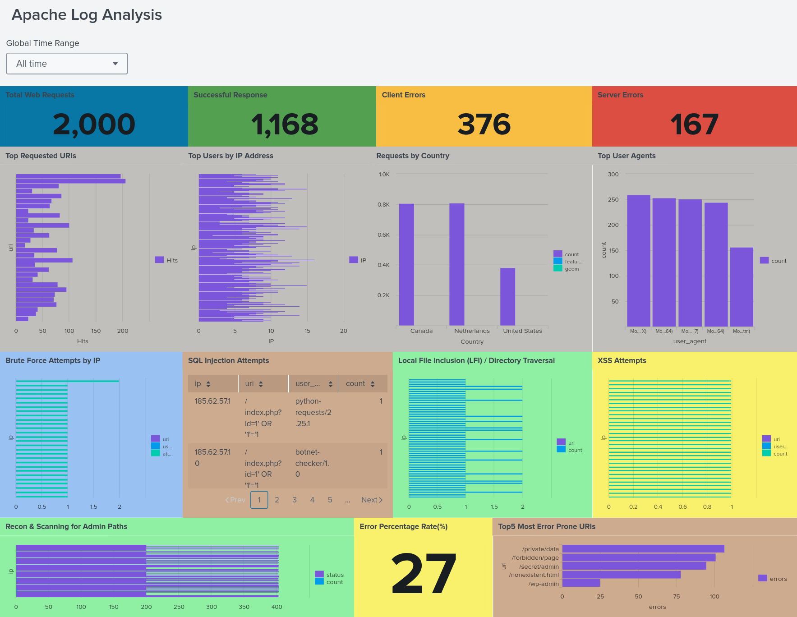

# Apache-Server-Log-Analysis-using-Splunk
This project guides you through analyzing Apache web server logs in Splunk to detect brute force attempts, SQL injection patterns, suspicious scanning activity, and XSS attacks. 

---

## 🎯 Objective  
To build a **Splunk dashboard** that provides clear insights into Apache web traffic — helping identify trends, request sources, and possible anomalies.  

---

## 🧩 Lab Setup  
- **Tool:** Splunk Enterprise  
- **Dataset:** `apache_logs.json`  
- **Host:** `Ubuntu`  
- **Sourcetype:** `_json`  

---

## ⚙️ Task 0: Setting up Time Range  

### 🕒 Add Time Range Input  
1. Go to **Edit Dashboard** → **Add Input** → Select **Time**  
2. Set **Label:** `Time Range`  
3. Set **Token:** `time_range`  
4. Add a **Submit** button  
5. Use `time_range` in every panel for consistent filtering  

---

## 📊 Task 1: Apache Traffic Overview  
**Goal:** Get a quick overview of how the web server is performing.  

### 1️⃣ Total Web Requests  
```spl
index=apache_logs 
| stats count as "Total Web Requests"
```

### 2️⃣ Successful Responses (HTTP 200)  
```spl
index=apache_logs method=GET status=200
| stats count as "Successful Response"
```

### 3️⃣ Client Errors (HTTP 4xx)  
```spl
index=apache_logs
| where status>=400 and status<500
| stats count as "Client Errors"
```

### 4️⃣ Server Errors (HTTP 5xx)  
```spl
index=apache_logs
| where status>=500 and status<600
| stats count as "Server Errors"
```

---

## 📊 TASK 2: Request & Source Analysis

### 1️⃣ Top Requested URIs
```spl
index=apache_logs
| stats count as Hits by uri
| sort -Hits
```

### 2️⃣ Top Requesting IPs
```spl
index=apache_logs
| stats count as Requests by ip
| sort -Requests
```

### 3️⃣ Requests by Country  
```spl
index=apache_logs method=GET
| table ip
| iplocation ip
| stats count by Country
| geom geo_countries featureIdField="Country"
```

### 4️⃣ Top User Agents
```spl
index=apache_logs
| stats count by user_agent
| sort -count 
```

---

## 🔐 TASK 3: Security Detection Panels

### 1️⃣ Detect Brute Force Login Attempts
Brute force attacks are repeated login attempts with different passwords to guess valid credentials. In Apache logs, this often appears as multiple requests to ```/login.php``` or ```/wp-login.php``` returning **401 Unauthorized** or **403 Forbidden**.

```spl
index=apache_logs (uri="/login.php" OR uri="/wp-login.php") (status=401 OR status=403)
| stats count AS attempts by ip, uri, user_agent
| sort -attempts
```
Here

* uri="/login.php" OR uri="/wp-login.php" to capture login endpoints.
* status=401 OR status=403 to focus on failed attempts.
This combination highlights IPs repeatedly failing login attempts ( **Brute force pattern**).

### 2️⃣ Identify SQL Injection Attempts (SQLi)
**SQL Injection (SQLi)** involves injecting SQL commands into HTTP requests to manipulate databases. Attackers often use payloads like ```' OR '1'='1``` or ```UNION SELECT```.

```spl
index=apache_logs uri="*' OR '1'='1*" OR uri="*UNION SELECT*"
| stats count by ip, uri, user_agent
```
Here

* ```uri``` because injection payloads are visible in the request path/query string.
* ```' OR '1'='1``` and ```UNION SELECT``` since these are classic SQLi attempts.
This helps us isolate malicious requests from normal browsing.

### 3️⃣ Spot Local File Inclusion (LFI) / Directory Traversal
**LFI and directory traversal** attacks attempt to read system files like ```/etc/passwd``` by using ```../``` in the URL.

```spl
index=apache_logs uri="*/etc/passwd*" OR uri="*../*"
| stats count by ip, uri
```
Here

* ```uri``` because attackers include traversal payloads in the request path.
* ```/etc/passwd``` and ```../``` patterns — common signs of file inclusion attacks.
  
### 4️⃣ Detect XSS Attempts
**XSS** injects malicious JavaScript into web pages, usually via ```<script>``` tags. It can appear raw ```(<script>)``` or URL-encoded ```(%3Cscript%3E)```.

```spl
index=apache_logs uri="*<script>*"
| stats count by ip, uri, user_agent
```
Here

* ```uri``` because attackers insert payloads in query parameters.
* ```<script>``` and ```%3Cscript%3E``` to cover both raw and encoded XSS.

### 5️⃣ Recon & Scanning for Admin Paths
Reconnaissance involves scanning for sensitive admin interfaces like ```/admin```, ```/phpmyadmin```, ```/wp-admin```, or hidden directories like ```/.git```.

```spl
index=apache_logs (uri="/admin" OR uri="/phpmyadmin" OR uri="/wp-admin")
| stats count by ip, status
```
Here

* ```uri``` because attackers target specific admin paths.
* ```status``` to see if attempts resulted in **200 (success)**, **403 (forbidden)**, or **404 (not found)**.

---

## 🧠 Task 4: Custom Insight Panels

### 1️⃣ Error Rate (%)

```spl
index=apache_logs
| eval category=if(status>=400,"Error","Success")
| stats count by category
| eventstats sum(count) as total
| eval percent=round((count/total)*100,2)
| where category="Error"
| fields percent
```

### 2️⃣ Top 5 Most Error-Prone URIs

```spl
index=apache_logs
| where status>=400
| stats count as errors BY uri
| sort -errors | head 5
```

---

## 🏁 Conclusion

This project demonstrated how Splunk can be used to analyze Apache web server logs and extract meaningful insights related to both performance and security. By building dashboards with panels for traffic overview, request patterns, geolocation data, and attack detection, we created a comprehensive monitoring solution that helps visualize normal activity as well as identify anomalies such as brute force attempts, SQL injection payloads, LFI attacks, XSS activity, and suspicious admin path scans.

* Through hands-on SPL queries and dashboard design, this lab strengthened understanding of:

* Parsing and visualizing web server logs

* Detecting malicious request patterns

* Using Splunk for log-based threat hunting

* Differentiating legitimate vs anomalous traffic

* Building clean, functional dashboards for security analytics

This dashboard can be extended further with alerting, drilldowns, lookup tables, and additional threat detection logic, making it a solid foundation for real-world web log monitoring.


